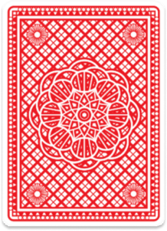
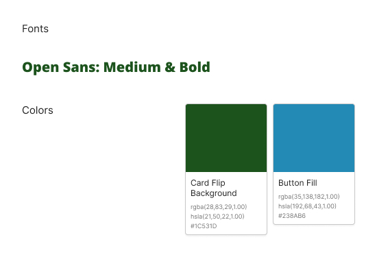

# Assignment: Card Match

In this week's activity, you will build a browser-based card matching game using HTML, TypeScript, and SCSS. The goal is to practice the Week Two concepts from Programming for Web Applications: strongly typed TypeScript, typed functions, enums, interfaces, type assertions, and organized SCSS.

## Learning Objectives

By completing this assignment, you should be able to:

- Set up and compile a TypeScript project.
- Use primitive data types, arrays, unions, enums, interfaces, and type assertions.
- Write functions with typed parameters and explicit return types.
- Use TypeScript to manage DOM-driven browser game logic.
- Write SCSS with variables, nesting, mixins, functions, and responsive layout rules.

## Reference Lessons

Use the lesson files in the `references/` folder while building your solution:

- [Overview](references/Overview.md)
- [Lesson: Introduction To TypScript](references/Lesson:%20Introduction%20To%20TypScript.md)
- [Lesson: Using Data Types](references/Lesson:%20Using%20Data%20Types.md)
- [Lesson: Typed Functions & Arguments](references/Lesson:%20Typed%20Functions%20&%20Arguments.md)
- [Lesson: Using Enumerations](references/Lesson:%20Using%20Enumerations.md)
- [Lesson: Introduction To Interfaces](references/Lesson:%20Introduction%20To%20Interfaces.md)
- [Lesson: Using Type Assertions](references/Lesson:%20Using%20Type%20Assertions.md)

## Game Objective

Create a card matching game where the player must find all matching pairs before running out of attempts.

The game must start with six cards face down. These six cards should contain three matching pairs. At the start of every new game, the card values and positions must be shuffled so the board is different each time.

An attempt is not a single card flip. One attempt means the player has selected two cards and the game compares them. If the two selected cards do not match, both cards flip back face down and the attempts counter decreases by one. If the two selected cards match, they stay face up and the attempts counter does not decrease.

## Required Game Rules

- Display six cards total.
- Include exactly three matching pairs.
- Start the player with three attempts.
- Allow the player to flip only two unmatched cards at a time.
- Keep matched cards face up or visibly locked.
- Flip non-matching cards back face down after a short delay.
- Decrease attempts only after an incorrect pair comparison.
- Display the number of attempts remaining.
- Display a win message when all three pairs are matched.
- Display a loss message when the player runs out of attempts before matching all pairs.
- Include a Start Over or Reset button that begins a new shuffled game.

Special cards such as Jacks, Queens, Kings, or Aces are optional. They will not earn extra credit, but you may include them if you want an additional challenge.

## Design Assets

You may create your own visual design, but your project must use the provided images in some meaningful way. The supplied design files are located in the `images/` folder.

### Game Mockup

The mockup shows the general layout, typography, color direction, attempts counter, flipped cards, message area, and reset button. The mockup uses four cards as a visual sample, but your completed assignment must use six cards.

.jpg>)

### Card Back Asset

Use this image for the face-down side of each card.



### Style Guide

Use the style guide as the baseline for fonts and colors.



Recommended style values:

- Font: Open Sans, medium and bold weights.
- Background color: `#1C531D`
- Button color: `#238AB6`
- Card front: light neutral background with large centered values.

## TypeScript Requirements

Your TypeScript must be compiled into JavaScript before it runs in the browser. Your code should compile with `strict` mode enabled.

Your solution must include:

- Typed variables for strings, numbers, booleans, arrays, and game state.
- At least one `enum`, such as `GameStatus`, `CardState`, or `CardValue`.
- At least one `interface` that describes the shape of a card object.
- Typed functions with explicit parameter and return types.
- At least one `void` function for behavior that updates the page without returning a value.
- A typed array of card data.
- Type assertions for DOM elements, such as `document.querySelector(".game-board") as HTMLElement`.
- No unnecessary `any` types.

Suggested interface example:

```ts
interface GameCard {
  id: number;
  value: string;
  isFlipped: boolean;
  isMatched: boolean;
}
```

Suggested enum example:

```ts
enum GameStatus {
  Playing = "playing",
  Won = "won",
  Lost = "lost"
}
```

You do not need to use these exact names, but your code should show the same TypeScript concepts.

## SCSS Requirements

Write your styles in SCSS. Your SCSS should include:

- Variables for repeated colors, spacing, font values, and card sizes.
- Proper nesting for related selectors.
- At least one mixin or function.
- Responsive layout rules so the game works on desktop and mobile screens.
- Clear styles for face-down cards, flipped cards, matched cards, disabled cards, game messages, and the reset button.

## Suggested Project Structure

You may adjust the structure if needed, but your final project should be easy to run and review.

```text
.
├── index.html
├── images/
│   ├── CardFlipGame(1).jpg
│   ├── card-flip-card-image.png
│   └── card-flip-style-guide.jpg
├── src/
│   └── index.ts
├── scss/
│   └── style.scss
├── dist/
│   ├── index.js
│   └── style.css
├── package.json
└── tsconfig.json
```

If you are using the existing `dev/` folder, keep your TypeScript source in `dev/src/index.ts` and compile it using the TypeScript compiler.

## Suggested Build Steps

From your project folder:

```bash
npm install --save-dev typescript
npx tsc
```

If you add your own scripts to `package.json`, you may also use:

```bash
npm run build
```

## Implementation Checklist

Before submitting, confirm that:

- The page loads without console errors.
- The board starts with six face-down cards.
- The cards shuffle on every new game.
- Only two cards can be compared at a time.
- Matching cards remain face up.
- Non-matching cards flip back over.
- Incorrect comparisons reduce the attempts counter.
- The game can be won.
- The game can be lost.
- The reset button starts a fresh shuffled game.
- TypeScript compiles without errors.
- SCSS is compiled into CSS and applied to the page.
- All provided image assets are used or referenced intentionally.

## Optional Challenges

- Add a flip animation.
- Add keyboard-accessible card selection.
- Add a timer.
- Add difficulty levels with more cards.
- Add sound effects for matching, missing, winning, and losing.
- Use number, letter, or suit-based card values.

## Submission

Submit the completed project files. Your submission should include your HTML, TypeScript source, compiled JavaScript, SCSS source, compiled CSS, image assets, and any project configuration files needed to run or review the game.
